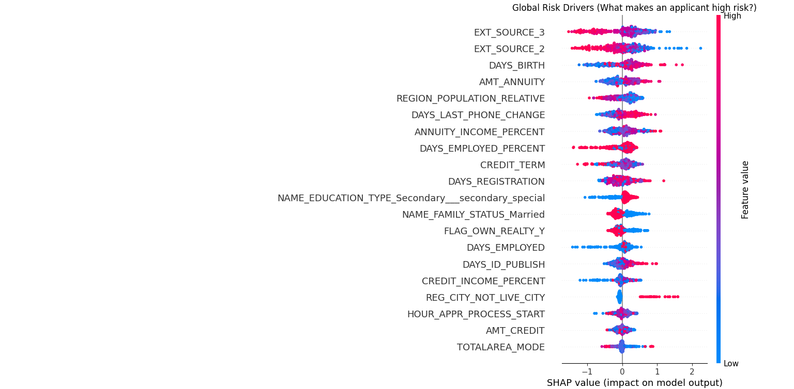

# Enterprise Credit Risk & Expected Loss Model 🏦

## 📌 Project Overview
This project upgrades traditional binary credit scoring by implementing a machine learning model that predicts the **Probability of Default (PD)** and calculates the **Expected Financial Loss (EL)** for consumer loans. Furthermore, it utilizes Explainable AI (SHAP) to ensure regulatory compliance with the Fair Credit Reporting Act (FCRA) by generating data-driven adverse action reasons.

## 🛠️ Tech Stack
* **Python** (Pandas, NumPy)
* **LightGBM** (Tree-based modeling optimized for imbalanced data)
* **Scikit-Learn** (Preprocessing, Validation)
* **SHAP** (Explainable AI / Model Interpretability)
* **Matplotlib & Seaborn** (Data Visualization)

## 🔬 Methodology & Architecture
1. **Data Engineering pipeline (`01_data_prep.py`):**  Ingested ~307,000 real-world loan applications.
   * Engineered domain-specific financial features (e.g., Debt-to-Income, Annuity-to-Income percent).
   * Handled extreme class imbalance (92% Repaid / 8% Default).
2. **Model Training (`02_model_training.py`):** Trained a LightGBM Classifier using balanced class weights to heavily penalize false negatives (missed defaults).
3. **Business Strategy & Compliance (`03_business_explainability.py`):**  **Expected Loss Math:** Implemented the banking equation `EL = PD * LGD * EAD` to dynamically route applications (e.g., Auto-Approve, Prime Rate, Premium Rate, or Reject).
   * **Explainable AI:** Generated SHAP summary plots to map out global risk drivers and isolate the exact variables leading to a loan denial.

## 📈 Results & Statistical Summary
* **ROC-AUC Score:** 0.7640
* **Default Detection (Recall):** Successfully identified **65% of all actual defaulters** in the test set.
* **Risk Tolerance (Precision):** Maintained a highly conservative risk profile (18% precision on high-risk flags), minimizing the bank's exposure to bad debt.

### Global Risk Drivers (SHAP)

* **Key Insight 1:** Low external credit scores (`EXT_SOURCE_2`, `EXT_SOURCE_3`) are the strongest predictors of default.
* **Key Insight 2:** Younger age (`DAYS_BIRTH`) and shorter employment history (`DAYS_EMPLOYED_PERCENT`) significantly increase the model's risk assessment.

## 🚀 How to Run this Project
1. Clone the repository.
2. Download the `application_train.csv` dataset from the Kaggle Home Credit Default Risk competition.
3. Run `python 01_data_prep.py` to clean the data and engineer features.
4. Run `python 02_model_training.py` to evaluate the LightGBM model.
5. Run `python 03_business_explainability.py` to simulate the Loan Desk and generate SHAP visuals.
